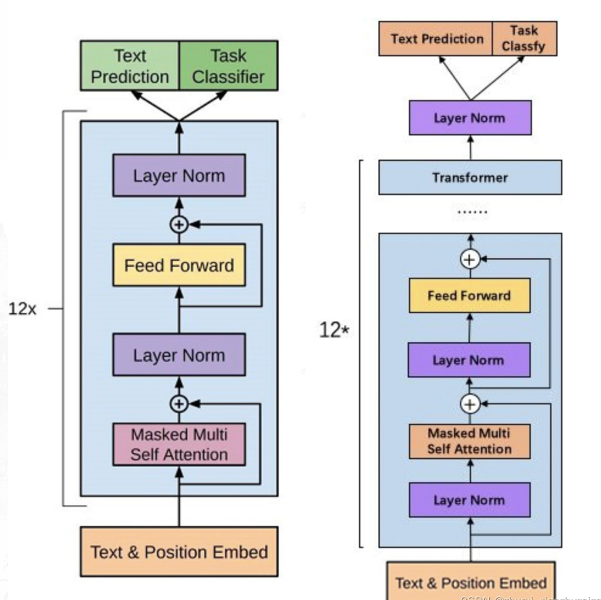
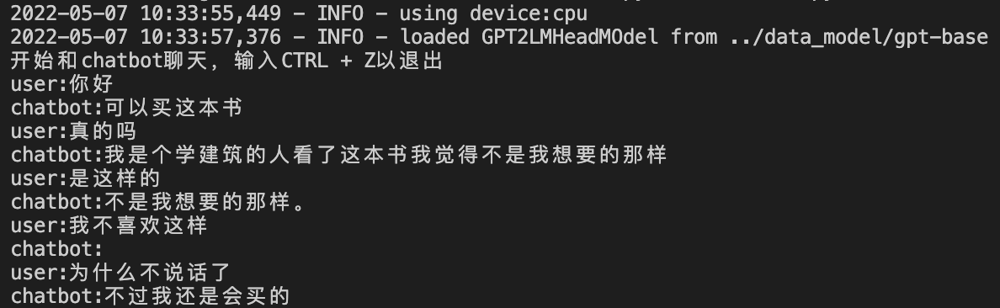
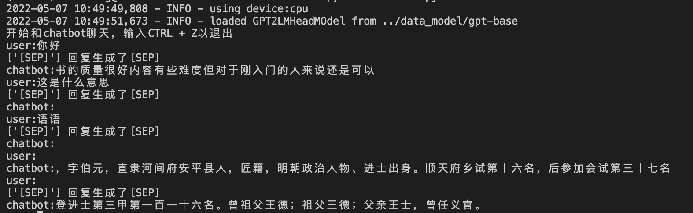
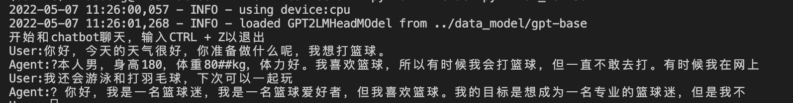

# Chinese Baike chat-robot using GPT-2
We have trained a robot with rich knowledge and strong interaction ability, which can support chat and advice in various fields such as health, life, study and so on. The basic framework is GPT-2, and the corpus is Chinese Baike Q&A data.
## Quick Start

### Environment (Prefer Conda)
This repo supports two pretrained model, GPT-chit-chat version and CDial-GPT version. Please prepare the environments respectively. 
#### For GPT-chit-chat: 
```
conda create -n chitchat
```
- transformers==4.4.2
- torch==1.8.0

#### For CDial-GPT: 
```
conda create -n CDial
```
- transformers==2.1.1
- torch==1.8.0

### Interact
Please download our pretrained models ([GPT-chat-chat](https://github.com/yangjianxin1/GPT2-chitchat), [CDial](https://github.com/thu-coai/CDial-GPT)), and easily replace the checkpoint path in interact.py and interact_CDial_GPT.py.
#### For GPT-chit-chat: 
```
conda activate chitchat
python iteract.py
```

#### For CDial-GPT: 
```
conda activate CDial
python iteract_CDial_GPT.py
```

## Train

### Prepare the data
Download the cropus [baike2018qa](https://github.com/brightmart/nlp_chinese_corpus#3%E7%99%BE%E7%A7%91%E7%B1%BB%E9%97%AE%E7%AD%94json%E7%89%88baike2018qa), and then process and encode the data (here we preverse 52w data, 50w data for training, 2w data for validation. **You can change the vacab.txt, but alway fix it when processing data, training and interacting.**) 
```
python pre_json.py
```
### Finetune the model
#### For GPT-chit-chat
Thanks to the great repo [GPT2-chit-chat](https://github.com/yangjianxin1/GPT2-chitchat), after download their shared pretrained model, we can do this work on selected cropus.
```
python finetune.py
```
#### For CDial-GPT
Thanks to the great model hub [CDial-GPT](https://github.com/thu-coai/CDial-GPT), we download the [Large version](https://huggingface.co/thu-coai/CDial-GPT_LCCC-large), and we finetune the model on selected cropus.
```
python finetune_CDial_GPT.py
```

## Work History (in Chinese)
### 语料准备
- [x] 下载[百科问答语料](https://github.com/brightmart/nlp_chinese_corpus#3%E7%99%BE%E7%A7%91%E7%B1%BB%E9%97%AE%E7%AD%94json%E7%89%88baike2018qa)，这里选取的数据集是：百科类问答json版(baike2018qa)。进行数据预处理。   
Step 1: 解析百科问答语料的json数据,提取对话内容,完成对话的拼接 \[CLS\]提问\[SEP\]回答\[SEP\].  
Step 2: 选取合适的Tokenizer进行text-encoding，进行序列化存储，保存为pkl文件。   
Step 3: load dataset，数据集的长度截断到max_len，才可以封装到batch。 

### GPT2
- [x] 阅读GPT2基本框架  


### 前端修改
- [x] 修改部分前端内容，demo如下所示  


### Inference the pretrained models
- [x] TODO: 重载GPT2-Chinese的预训练模型, inference完成。 ddl (May 5, 2022)
- [x] 这里使用的是GPT2-Chinese的[通用中文模型-base](https://drive.google.com/drive/folders/1dLEANs5z4pWS0pzrak6Q2H2Nq4iYsMsf)。当然也可以使用[通用中文模型-small](https://drive.google.com/drive/folders/1eerX1N8n_eFlnQ4xpxZ4iU2-Mx83pXFp)，可以加快推理速度。
- [x] Problrms: 如果控制回答的长度（输出回复长度较短）

1）调整max_len，原始值=25，重新设置为50. 主要原因是回复生成了[SEP]，默认认为结束了回复。

2）设置如果大于max_len并且生成了[sep]则回复结束，将[SEP]变成“句号”即可。 ps (速度很慢)
 

- [x] 存在问题：语言模型用来对话效果很差，逻辑性很差。
尝试：使用闲聊语料的预训练模型而不是通用语料的预训练模型，是不是会不一样？   
- [x] 推理CDial-GPT2预训练模型时，因为transformers库版本太高，模型加载出现问题，只能使用老版本的。Conda环境使用CDial-GPT。对话的结果如下所示：  

- [x] 报错问题：vocab.txt与config.json里设置的词表长度的一致，预训练模型的checkpoint中的词表长度与输入数据的映射词表需要一致。

### Fine-tune
- [x] 读懂训练的代码
- [x] TODO: run起来fine-tune的代码。ddl（May 7, 2022）
- [x] train代码整理到Kaggle上 (Done!)   
- [x] pickle数据集太大，在kaggle平台上load不了,先创建一个小数据集：只包含12万条问答的small-data用来训练。（Done!）  
- [x] 训练代码已迁移到Kaggle平台（初步方案），notebook如[gpt2-baike.ipynb](./gpt2-baike.ipynb)所示。（Done!）  

- [x] ? finetune loss得不到收敛，需要调lr, bs, ls_scheduler......    
- [x] 尝试扩大训练集大小，12w条对话太小，扩增到30w条训练数据。   
- [x] 使用chit-chat的预训练模型进行fine-tune。chit-chat是在闲聊中文语料上预训练的GPT-2模型，在这里将其在百科问答数据集上进行微调。
- [x] 微调chit-chat 1 epoch
- [x] 微调chit-chat 2 epoch
- [x] 确定处理问答数据集中的前52w条的数据进行模型训练，50w作为训练集，2w作为验证集。
- [x] 基于不同的预训练模型进行微调训练


### inference (Final)
Finetuned the gpt-chit-chat model on 32w datasets.
- [x] Inference the finetuned 1 epoch checkpoint, compared with the original chit-chat model.
- [x] Inference the finetuned 4 epochs checkpoint, compared with the original chit-chat model.
- [x] TODO: Inference finetuned model.


### Transfer

- [ ] TODO: Transfer PyTorch to PaddlePaddle


## Reference
[1] https://github.com/yangjianxin1/GPT2-chitchat   
[2] https://github.com/thu-coai/CDial-GPT   
[3] https://github.com/brightmart/nlp_chinese_corpus   
[4] https://github.com/Morizeyao/GPT2-Chinese   

